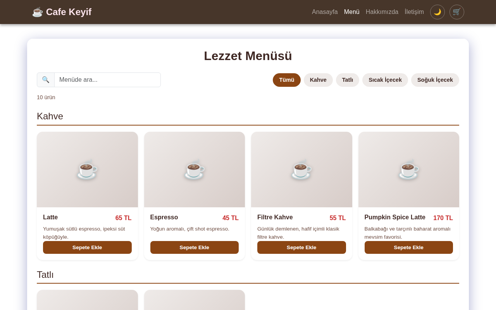
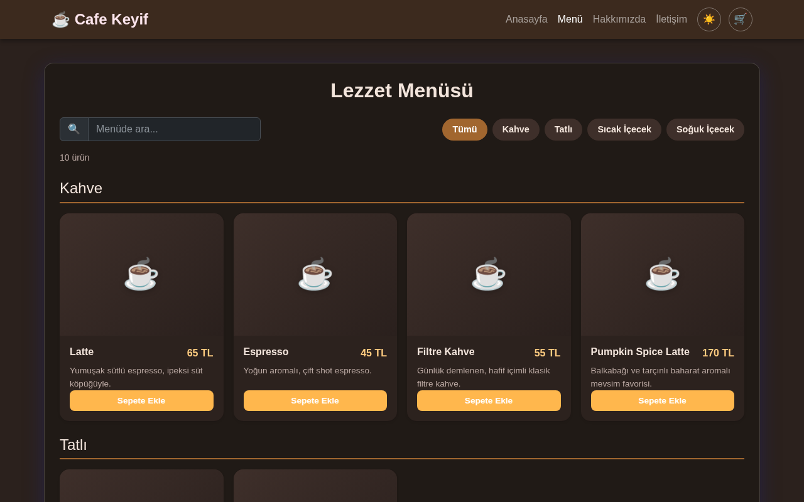
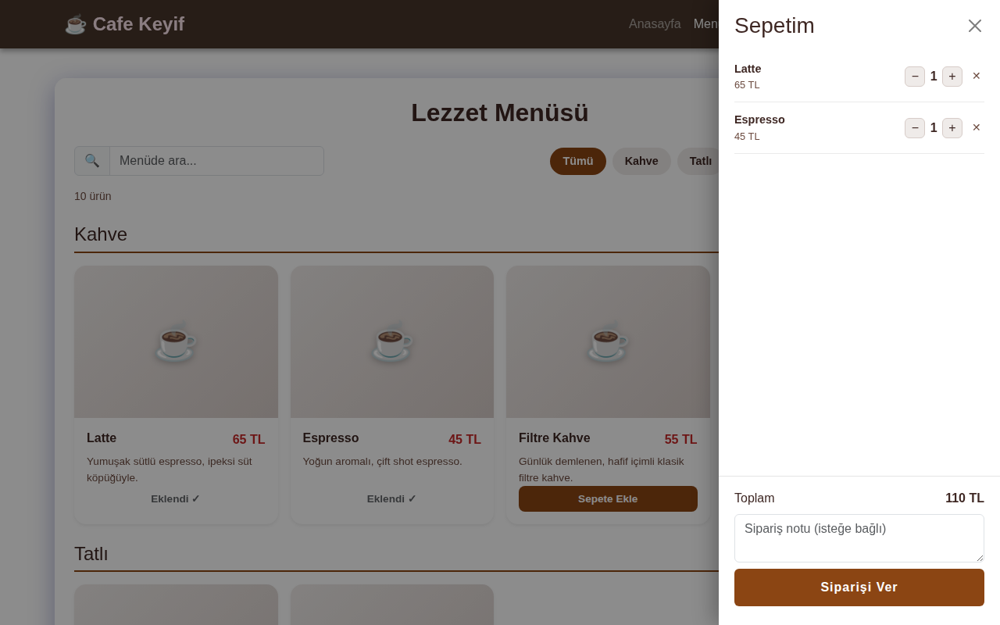
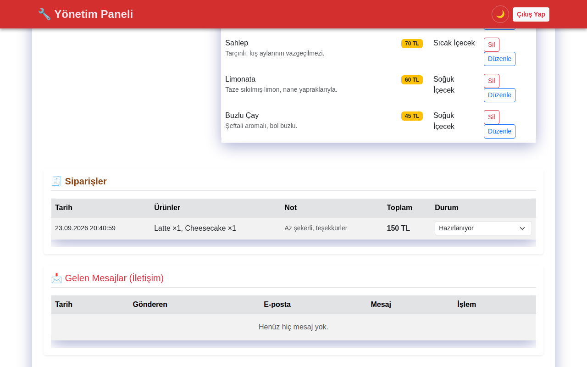

# ☕ Cafe Keyif

Kurgusal bir kafe için geliştirilmiş, **menü ve mesaj yönetimi** yapan tam yığın (full-stack) web uygulaması. Ziyaretçiler güncel menüyü görüntüleyip iletişim formu gönderebilir; yönetici giriş yaparak ürünleri **ekleyebilir, düzenleyebilir, silebilir** ve gelen mesajları yönetebilir.

> *English:* A full-stack café website built with Node.js, Express and SQLite. Visitors can browse the menu and send messages; an authenticated admin can manage menu items (CRUD) and read/delete contact messages.


🔗 **Canlı demo:** https://cafe-keyif.onrender.com
*(Ücretsiz Render planında çalıştığı için ilk açılış 2-3 dakika sürebilir ve sunucu yeniden başladığında veritabanı sıfırlanır.)*

| Menü (açık tema) | Menü (koyu tema) |
| --- | --- |
|  |  |

| Sepet | Yönetim paneli - Siparişler |
| --- | --- |
|  |  |

## Özellikler

- 📋 Kategorilere göre gruplanmış dinamik menü sayfası; ürün kartlarında görsel, açıklama ve fiyat
- 🔎 Kategori filtresi ve arama kutusu (Türkçe karakterlerden bağımsız: "cay" yazınca "Çay" da bulunur)
- 🌙 Açık/koyu tema; tercih tarayıcıda saklanır, ilk açılışta sistem temasına uyulur
- 🛒 Sepet: ürün ekleme, adet değiştirme, sipariş notu; sepet tarayıcıda saklanır
- 🧾 Sipariş yönetimi: yönetim panelinde gelen siparişler ve "Hazırlanıyor / Teslim edildi" durum takibi
- 🔧 Yönetim paneli: ürün ekleme, düzenleme (ad, fiyat, kategori, açıklama, görsel), silme (CRUD)
- 🔐 Sunucu taraflı yönetici girişi (imzalı, süreli token); yönetim uçları korumalıdır
- 📩 İletişim formu ve yönetim panelinde mesaj listesi
- ✅ Sunucu tarafında doğrulama: boş alan, negatif fiyat, aynı isimli ürün kontrolü
- 🛡️ XSS'e karşı HTML kaçışı, parametreli SQL sorguları
- 🔒 Yönetici şifresi `bcrypt` ile hash'lenir, düz metin olarak karşılaştırılmaz
- ✅ Jest + Supertest ile otomatik testler, her push'ta GitHub Actions ile çalışır
- 📱 Bootstrap 5 ile responsive tasarım

## Teknolojiler

| Katman | Teknoloji |
| --- | --- |
| Backend | Node.js, Express 5 |
| Veritabanı | SQLite (`sqlite3`) |
| Frontend | HTML5, CSS3, JavaScript (ES6+), Bootstrap 5 |
| Barındırma | Render |

## Kurulum

Gereksinim: **Node.js 18+**

```bash
git clone https://github.com/mertokzlky/cafe-keyif.git
cd cafe-keyif
npm install
cp .env.example .env    # ardından .env içindeki değerleri düzenleyin
npm start
```

Uygulama `http://localhost:3000` adresinde açılır. Veritabanı (`cafe.db`) ilk çalıştırmada otomatik oluşturulur ve örnek ürünlerle doldurulur.

Yönetim paneli: `http://localhost:3000/login.html`
Kullanıcı adı ve şifre `.env` dosyasındaki `ADMIN_USER` ve `ADMIN_PASS` değerleridir.

### Ortam değişkenleri

| Değişken | Açıklama | Varsayılan |
| --- | --- | --- |
| `PORT` | Sunucu portu | `3000` |
| `ADMIN_USER` | Yönetici kullanıcı adı | `admin` |
| `ADMIN_PASS_HASH` | Yönetici şifresinin bcrypt hash'i (önerilen) | — |
| `ADMIN_PASS` | Yönetici şifresi, düz metin (yalnızca yerel geliştirme için; `ADMIN_PASS_HASH` yoksa her açılışta hash'lenir) | `1234` |
| `SESSION_SECRET` | Token imzalama anahtarı | Her başlatmada rastgele üretilir |

Şifre hash'i üretmek için:

```bash
npm run hash-password -- "seciminiz-olan-sifre"
```

Çıkan değeri `ADMIN_PASS_HASH` olarak `.env`'e ya da Render'daki ortam değişkenlerine yazın; bu durumda `ADMIN_PASS` hiç tanımlanmasına gerek kalmaz ve düz metin şifre sunucu ortamında bulunmaz.

## Testler

```bash
npm test
```

Testler gerçek bir sunucu açmaz; Express uygulamasını bellekte (`:memory:`) ayrı bir SQLite veritabanıyla doğrudan çağırır. Kimlik doğrulama, menü doğrulamaları (negatif fiyat, aynı isim — Türkçe büyük/küçük harf dahil), sipariş oluşturma ve **fiyatın istemciden değil sunucudaki veritabanından hesaplandığını** doğrulayan testler içerir. `main` dalına her push'ta ve her Pull Request'te [GitHub Actions](.github/workflows/test.yml) ile otomatik çalışır.

## API

| Metot | Uç nokta | Açıklama | Yetki |
| --- | --- | --- | --- |
| `POST` | `/api/login` | Giriş yapar, token döner | Herkese açık |
| `GET` | `/api/menu` | Menüyü listeler | Herkese açık |
| `POST` | `/api/menu` | Ürün ekler (`name`, `price`, `category`, isteğe bağlı `description`, `image`) | Yönetici |
| `PUT` | `/api/menu/:id` | Ürün günceller | Yönetici |
| `DELETE` | `/api/menu/:id` | Ürün siler | Yönetici |
| `POST` | `/api/messages` | İletişim mesajı gönderir | Herkese açık |
| `GET` | `/api/messages` | Mesajları listeler | Yönetici |
| `DELETE` | `/api/messages/:id` | Mesaj siler | Yönetici |
| `POST` | `/api/orders` | Sipariş oluşturur (`items: [{id, qty}]`, isteğe bağlı `note`) | Herkese açık |
| `GET` | `/api/orders` | Siparişleri listeler | Yönetici |
| `PUT` | `/api/orders/:id/status` | Sipariş durumunu günceller | Yönetici |

Yönetici uçları `Authorization: Bearer <token>` başlığı bekler.

## Proje yapısı

```
cafe-keyif/
├── index.js          # Express sunucusu, API ve veritabanı
├── package.json
├── .env.example      # Ortam değişkeni şablonu
├── .gitignore
└── public/           # Statik frontend
    ├── index.html    # Ana sayfa
    ├── menu.html     # Menü
    ├── about.html    # Hakkımızda
    ├── contact.html  # İletişim formu
    ├── login.html    # Yönetici girişi
    ├── admin.html    # Yönetim paneli
    ├── style.css
    └── theme.js  # Açık/koyu tema düğmesi
```

## Geliştirme fikirleri

- Sipariş geçmişinin sayfalanması ve tarihe göre filtrelenmesi
- Yöneticiler için ayrı kayıtlar (tek bir ortam değişkeni yerine kullanıcı tablosu)
- Ürün görseli yükleme
- Kalıcı veritabanı (PostgreSQL) ile canlıya alma
- Otomatik testler (Jest + Supertest)

## Geliştirici

**Mert Ali Kızılkaya** — Yazılım Mühendisliği öğrencisi
GitHub: [@mertokzlky](https://github.com/mertokzlky)

